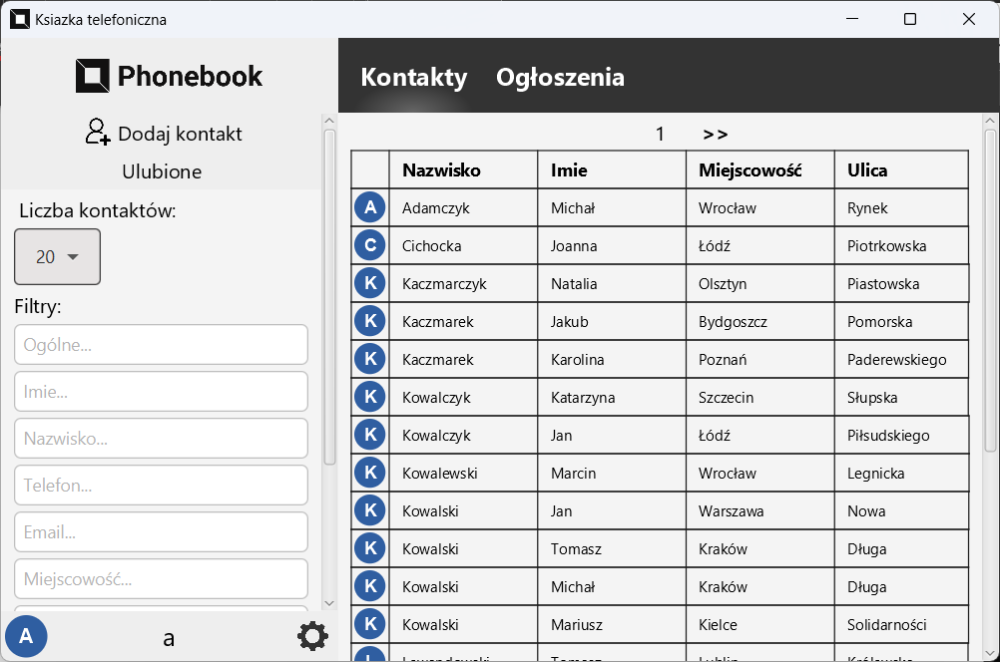
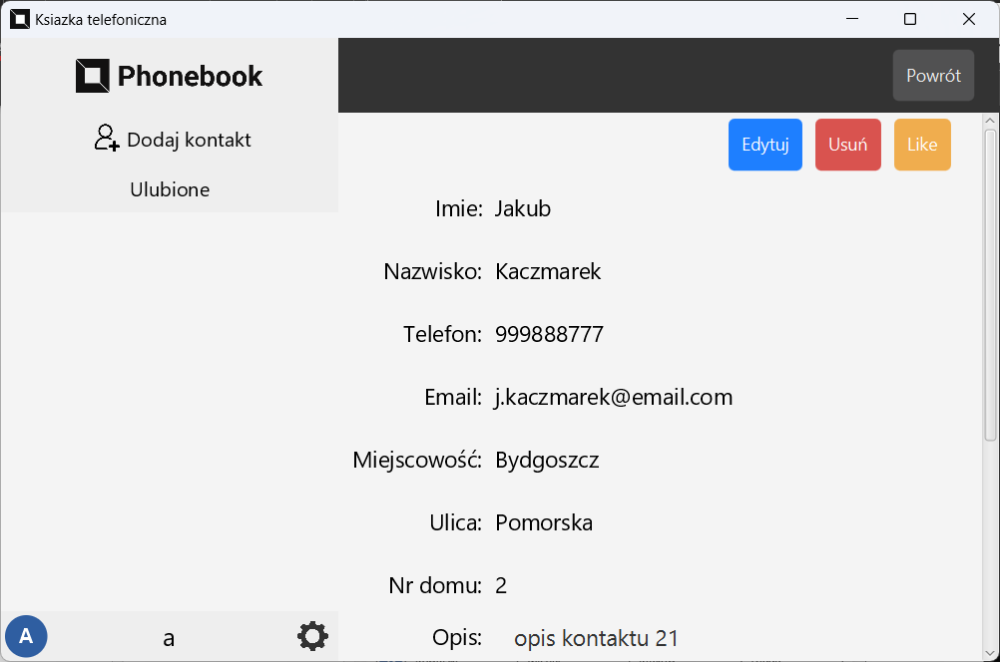
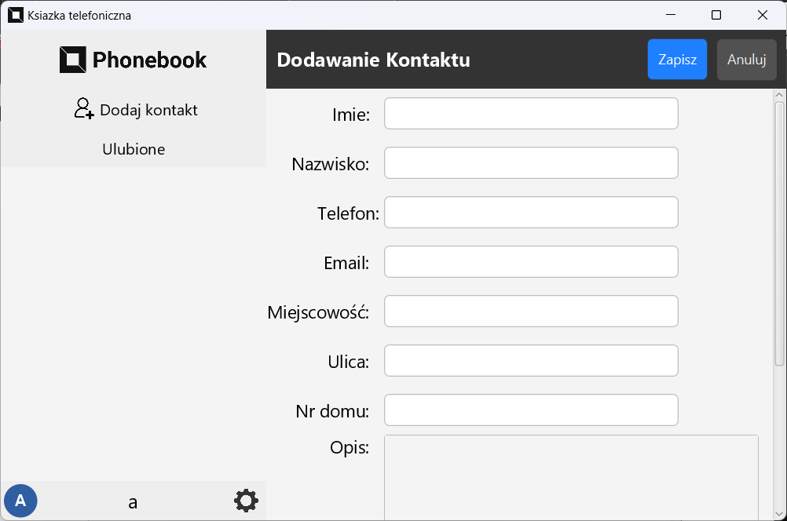
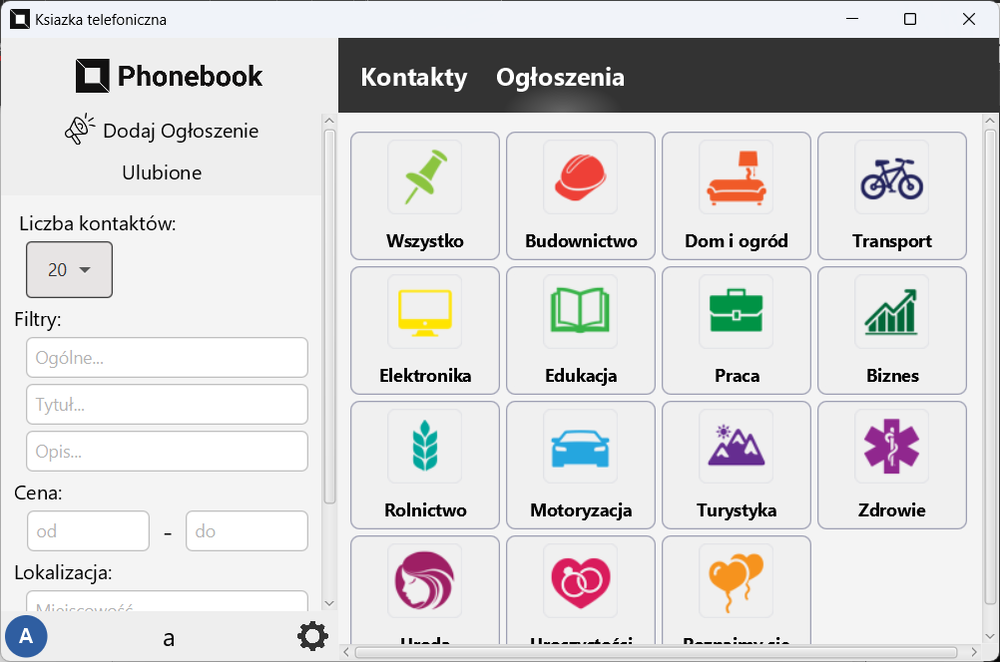
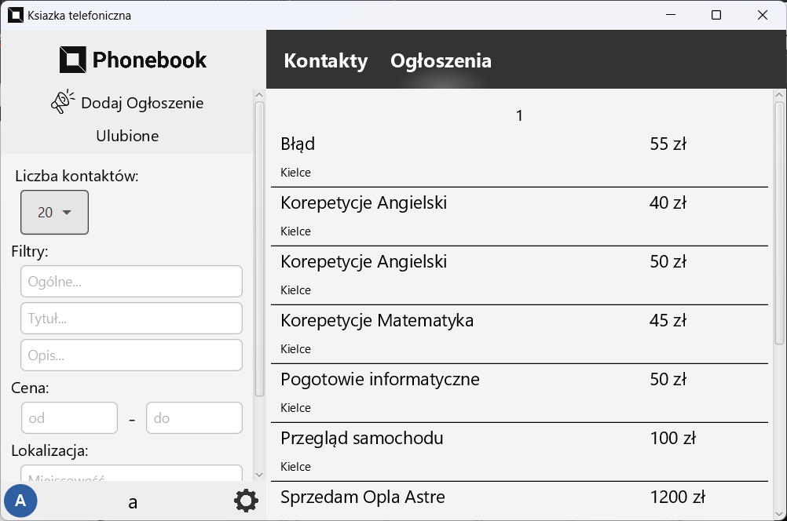

# Kontakty z Ogłoszeniami

Aplikacja desktopowa wykonana z wykorzystaniem JavaFX i SQLite, umożliwiająca zarządzanie bazą numerów telefonów oraz powiązanych ogłoszeń.  
Użytkownicy mogą dodawać, edytować oraz usuwać kontakty i ogłoszenia z poziomu interfejsu graficznego, co zapewnia łatwe korzystanie z funkcji programu.

Interfejs aplikacji pozwala na szybki dostęp do listy kontaktów oraz szczegółów ogłoszeń.

---

## Zrzuty ekranu

### Ekran główny listy kontaktów

  

  
### Dodawanie i edycja kontaktu

  
  

---

### Ekran główny ogłoszeń

### Ekran listy ogłoszeń

---
